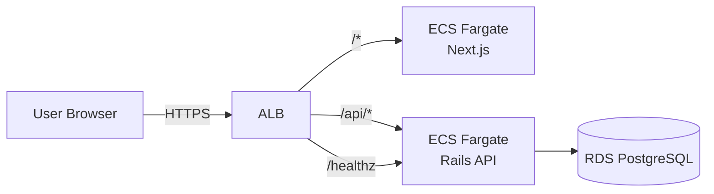
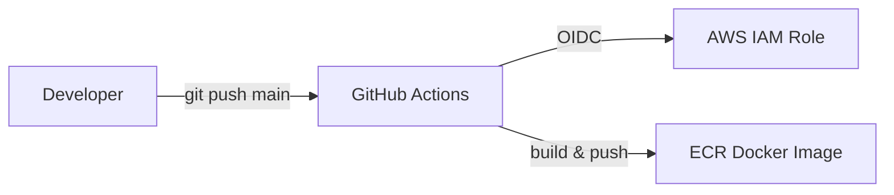
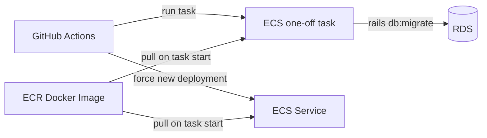

# Otayori App（ポートフォリオ）

教師と生徒（/保護者）向けのお便り管理アプリ。  
Rails API + Next.js を AWS ECS/Fargate 上で運用し、Terraform による IaC と  
GitHub Actions を用いた CI/CD を構築しています。

## 技術スタック

- Frontend: Next.js（App Router）
- Backend: Ruby on Rails（API）
- DB: PostgreSQL（RDS）
- Infra: AWS（ECS/Fargate, ALB, RDS, ECR）
- IaC: Terraform（S3 + DynamoDB による tfstate 管理）
- CI/CD: GitHub Actions（OIDC による AWS 認証）

## 機能概要（抜粋）

- 教師 / 生徒のロール選択ログイン（`/login`）
- JWT を用いた認証
- フロントエンドとバックエンドを分離した API 設計
- API パスを `/api/*` に統一
- `/healthz` によるアプリケーションの死活確認

※ 本 README では構成・運用面にフォーカスし、機能詳細は省略しています。

## 使い方（デモ操作）

### 1. 教師アカウントの登録

- URL
  ```
  http://localhost:3000/signup/teacher
  ```

1. 上記 URL にアクセス
2. メールアドレス・パスワードを入力して登録
3. 登録完了後、教師ダッシュボードへ遷移します

### 2. ログイン方法

- URL
  ```
  http://localhost:3000/login
  ```

1. ログイン画面で 教師 / 生徒 のロールを選択
2. 登録済みのメールアドレス・パスワードでログイン
3. ロールに応じた画面へ遷移します

### 3. 生徒アカウントの招待

1. 教師としてログイン
2. ダッシュボードから「生徒を招待」を選択
3. 生徒のメールアドレスを入力
4. 招待メール経由で生徒アカウントを作成・参加できます

## アーキテクチャ

### 構成図（ALB → Frontend / Backend → RDS）



### 構成のポイント

- ALB を **単一の公開入口**として採用
- パスベースルーティングによる責務分離
  - `/*` → Next.js（画面配信）
  - `/api/*` → Rails API
  - `/healthz` → Rails API
- RDS は Rails API からのみアクセス可能

## フロントエンドと API 通信について

- API リクエスト（`/api/*`）は **ブラウザから直接送信**されます
- ALB のパスベースルーティングにより Rails API に転送されます
- **Next.js サーバは API 通信には関与しません**
  - SSR / Route Handler / BFF 構成は採用していません

### ローカル開発と本番環境における API 通信設計

本アプリケーションでは、ローカル開発環境と本番環境で
API 通信の責務を明確に分離しています。

#### ローカル開発環境（Next.js rewrites）

ローカルでは Next.js の `rewrites` 機能を利用し、
フロントエンドが Rails API へのリバースプロキシとして振る舞います。

通信経路は以下の通りです。

```
  Browser
    ↓
  Next.js（localhost:3000）
    ↓ rewrites
  Rails API（localhost:3001）
```

この構成により、以下を実現しています。

- ブラウザからは常に同一オリジン（localhost:3000）で API を呼び出せる
- CORS 設定を不要にし、JWT Cookie を用いた認証確認を容易にする
- フロントエンドとバックエンドを分離したまま、開発体験を簡潔に保つ

rewrites の設定は以下の通りです（ローカル開発用）。

frontend/next.config.ts（抜粋）
async rewrites() {
return [
{
source: "/api/:path*",
destination: "http://localhost:3001/api/:path*",
},
];
}

#### 本番環境（ALB によるパスベースルーティング）

本番環境では Application Load Balancer（ALB）が単一の公開入口となり、
パスベースルーティングにより Frontend / Backend を振り分けています。

ALB のルーティング設定は Terraform で管理しており、
以下のファイルに定義しています。

- infra/resource_modules/alb/main.tf

設定の要点は次の通りです。

- ALB Listener の default action により、デフォルトは Frontend（Next.js）へ転送
- `/api/*` のみ Backend（Rails API）へ転送する Listener Rule を定義
- `/api/*` のルールは priority を明示的に設定し、`/*` より優先されるように制御

通信の流れは以下の通りです。

```
  ALB Listener (80)
    ├ default: forward → frontend target group（/*）
    └ rule (priority=10, /api/*): forward → backend target group
```

このように、ローカルでは Next.js が ALB の代役として API を中継し、
本番ではその責務を ALB に戻すことで、
開発体験と本番構成の整合性を両立しています。

## CI/CD（backend）

本プロジェクトでは、`git push` を起点として Docker イメージを ECR に push し、  
**backend 配下に変更が含まれる場合のみ**  
DB migration と ECS Service の再起動を行います。

### git push 時の CI（Docker build & push）



- `main` ブランチへの push を起点に GitHub Actions が起動します
- OIDC により AWS IAM Role を Assume します
- backend の Docker イメージを build し、ECR に push します

### backend 配下の変更を伴う git push 時の CD（migrate → deploy）

※ 前提：上記 CI により **最新の Docker イメージが ECR に push 済み**



#### 処理の流れ

1. `backend/**` 配下に変更を含む `git push` を検知して GitHub Actions が起動
2. **ECR 上の Docker イメージ**を用いて  
   ECS RunTask により `rails db:migrate` を実行
3. migration 成功後、ECS Service を  
   `force new deployment` により再起動
4. ECS は **新しいタスク起動時に ECR から最新イメージを pull** して起動

### ポイント

- GitHub Actions から AWS への認証には **OIDC** を利用
  - AWS のアクセスキー等の **長期クレデンシャルは使用していません**
- `backend/**` に変更がある場合のみ  
  **migration と ECS Service の更新**を行います
- DB migration は ECS Service とは別に  
  **one-off task（ECS RunTask）**として実行します
- migration が失敗した場合は  
  **ECS Service を更新せずデプロイを中断**します
- ECS は **タスク起動時に ECR から Docker イメージを pull**するため、  
  `force new deployment` により  
  **最新のイメージを確実に反映**しています

## DB Migration 運用方針（dev）

### 基本方針

- `backend/**` に変更がある push のたびに migration を実行
- migration は ECS Service とは別の **one-off task** として実行
- migration 成功後に ECS Service を更新

### 初回

- 初回は別途 `rails db:migrate` を実行
- seed は不要方針（必要になった場合は別手順で実行）

## ローカル開発構成

- DB: Docker（PostgreSQL）
- Rails API: Mac ローカル（`:3001`）
- Next.js: ローカル（`:3000`）

### API 統一方針

- API は `/api/*` に統一
- ローカル: Next.js rewrites により Rails API に転送
- 本番: ALB の path-based routing により Rails API に転送

## 起動方法（ローカル開発）

ローカル開発では、DB のみ Docker で起動し、  
Rails API と Next.js は Mac ローカルで起動します。

### 1. DB（PostgreSQL）の起動

```bash
cd backend
docker compose up -d
```

PostgreSQL コンテナが起動していることを確認します。

```bash
docker ps
```

### 2. Rails API の起動（:3001）

```bash
cd backend
bundle install
bin/rails db:prepare
bin/rails s -p 3001
```

起動後、以下にアクセスして疎通確認します。

```bash
curl http://localhost:3001/api/healthz
```

`200 OK` が返れば正常です。

### 3. Next.js の起動（:3000）

```bash
cd frontend
npm install
npm run dev
```

ブラウザで以下にアクセスします。

- http://localhost:3000/login

## 起動方法（AWS / dev 環境）

本プロジェクトの dev 環境は、Terraform により構築した  
ECS(Fargate) + ALB 構成上で起動します。

## AWS 初期構築手順（Terraform / dev 環境）

本プロジェクトでは、Terraform のスタックを以下のように分離しています。

- `bootstrap_remote_state` : Terraform Remote State（S3 / DynamoDB）
- `composition/dev-ecr` : ECR（frontend / backend）
- `composition/dev-iam` : GitHub Actions 用 IAM（OIDC）
- `composition/dev` : アプリ本体（VPC / ALB / ECS / RDS）

それぞれ **独立した Terraform スタック**のため、  
**各ディレクトリごとに `terraform init` が必要**です。

また、`composition/dev` では ECR を `data` 参照しているため、  
**ECR → IAM → dev 本体** の順で構築します。

### Step 1. Terraform Remote State を構築（bootstrap）

Terraform の state 管理用に S3 + DynamoDB を作成します。

```
cd infra/bootstrap_remote_state
terraform init
terraform apply
```

### Step 2. ECR を構築（dev-ecr）

アプリ本体が参照する ECR リポジトリ（frontend / backend）を作成します。

> `dev-ecr` は dev 本体とは別スタックのため、`terraform init` が必要です。

```
cd infra/composition/dev-ecr
terraform init
terraform apply
```

作成確認：

```
aws ecr describe-repositories --query 'repositories[*].repositoryName'
```

### Step 3. IAM（GitHub Actions OIDC）を構築（dev-iam）

GitHub Actions が AWS にアクセスするための IAM Role（OIDC）を作成します。

> `dev-iam` も別スタックのため、`terraform init` が必要です。

```
cd infra/composition/dev-iam
terraform init
terraform apply
```

作成後、GitHub Secrets に登録するために Role ARN を取得します。

```
terraform output
```

### Step 4. dev 本体スタックを Remote State に接続（init）

ECR / IAM が揃った後で、dev 本体スタックを初期化します。

```
cd infra/composition/dev
terraform init -reconfigure
terraform plan
```

### Step 5. dev 本体を構築（VPC / ALB / ECS / RDS）

アプリケーション本体の AWS リソースを作成します。

```
terraform apply
```

この時点で以下が **AWS 上に作成され、値を確認できる** 状態になります。

- ALB DNS 名（アクセス先 URL）
- ECS Cluster / Service（backend）※ 既に GitHub Secrets に登録済みの場合は、値が正しいことを確認する

補足：

- Terraform apply 直後は ECS タスク起動と ALB health check が完了するまで、
  一時的に 503 が返る場合があります（数十秒〜数分で解消することがあります）。

### Step 6. GitHub Actions Secrets を登録

GitHub Actions が AWS/ECS を操作するために Secrets を登録します。

登録場所：

GitHub → Repository → Settings → Secrets and variables → Actions → Repository secrets

#### 登録する Secrets と意味

- `AWS_ROLE_ARN`  
  GitHub Actions が OIDC で AssumeRole する **IAM Role の ARN**。  
  `dev-iam` の `terraform output` で取得した値を設定します。  
  **初期構築時や IAM を作り直した場合は必ず変更が必要**です。

- `ECS_CLUSTER`  
  デプロイ対象となる **ECS Cluster 名（または ARN）**。

- `ECS_SERVICE_BACKEND`  
  デプロイ対象となる **backend ECS Service 名（または ARN）**。

### Step 7. CI/CD 実行と疎通確認

GitHub Actions の workflow  
`Deploy dev backend (migrate then deploy)` を手動実行し、以下を確認します。

- OIDC による AWS 認証が成功する
- one-off migration が成功する
- ECS Service が更新される

ALB 経由で疎通確認：

```
aws elbv2 describe-load-balancers \
  --query 'LoadBalancers[*].{Name:LoadBalancerName,DNS:DNSName}'
```

```
curl -i http://<ALB_DNS>/healthz
curl -i http://<ALB_DNS>/login
```

- `/healthz` が `200` → backend 正常
- `/login` が `200 / 302` → frontend 正常

### ローカルでの API 通信について

- フロントエンドからの API リクエストは `/api/*` に統一しています
- ローカル環境では Next.js の rewrites により Rails API（:3001）へ転送されます
- 本番環境では ALB のパスベースルーティングにより Rails API へ直接転送されます

## Terraform 構成

- `infra/` 配下で Terraform 管理
- S3 + DynamoDB による remote state
- ECS / ALB / RDS / ECR を IaC 化

## セキュリティに関する補足

- GitHub Actions から AWS への認証は OIDC + AssumeRole を使用
- GitHub Secrets には Role ARN や ECS リソース名を保持
  - これらは **単体で AWS 操作が可能な情報ではありません**
- AWS API を実行可能な長期クレデンシャルは GitHub に保存していません

## メール送信（SendGrid）について

本アプリケーションでは、メール送信に SendGrid を利用しています。

### 認証情報の管理

- SendGrid の API Key（パスワード相当）は **環境変数で管理**しています
- ローカル開発環境では `.env` ファイルを使用しています
- 本番環境では Secrets Manager などを用いて安全に注入する想定です

  ```
  SENDGRID_API_KEY=xxxxxxxx
  ```

### メール送信の有効 / 無効切り替え

- 本システムでは、**環境変数 `MAIL_REAL_SEND`** によって  
  メールの実送信を制御しています
- `MAIL_REAL_SEND=true` の場合のみ、実際にメールが送信されます
- デフォルトでは誤送信防止のため `false` となっています

  ```
  MAIL_REAL_SEND=true
  ```

※ 開発環境では実送信を抑止し、本番環境でのみ有効化する運用を想定しています

## 採用担当者に見てほしいポイント

- Terraform による AWS 本番相当の構成管理
- ALB を起点とした明確な責務分離（Frontend / Backend）
- OIDC を用いた GitHub Actions → AWS 認証
- ECS RunTask を用いた安全な migration 運用
- README と実装の整合性を重視した設計
